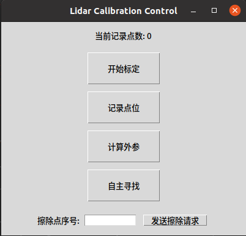

# Lidar Calibration Node

## 概述

本节点用于实现激光雷达（LiDAR）之间的标定。通过订阅源激光雷达和目标激光雷达的点云数据，计算两者之间的变换关系，并发布相应的变换结果。节点还支持通过动态参数配置进行标定参数的调整。

## 依赖

- ROS (Robot Operating System)
- `tf2_ros` 用于发布坐标变换
- `dynamic_reconfigure` 用于动态参数配置
- `pcl_ros` 用于点云数据处理

## 编译

1. 确保已经安装了ROS和相关的依赖包;
2. 将本节点放入你的ROS工作空间的`src`目录下;
3. 在工作空间根目录下运行以下命令进行编译：

   ```bash
   catkin_make

## 运行
1. 在工作空间根目录下运行以下命令进行编译：
   ```bash
   source devel/setup.bash
   ```
   ```bash
   roslaunch lidar_to_lidar_calibration lidar_to_lidar_calibration.launch
   ```
2. 确保源激光雷达和目标激光雷达的数据已经发布到相应的ROS话题上。
   
## 参数配置
1. 运行文件参数配置
* source_lidar_topic: [**string类型**] 源点云话题名
* source_cloud_type:  [**int类型**] 源点云雷达类型(0:机械旋转式多线雷达[velodyne,rslidar]; 1:混合固态（半固态）多线雷达[mid360])
* target_lidar_topic: [**string类型**] 目标云话题名
* target_cloud_type: [**int类型**] 目标点云雷达类型(0:机械旋转式多线雷达[velodyne,rslidar]; 1:混合固态（半固态）多线雷达[mid360])
* flag_topic: [**string类型**] Header类型交互话题名
* lidar_queue_threshold: [**int类型**] 点云融合帧数
* svd_threshold: [**double类型**] REMS阈值
* board_l: [**double类型**] 标定板边长
* tf_publish: [**bool类型**] 是否发布两个坐标系的tf变换
2. 动态参数配置
   
    节点支持通过**dynamic_reconfigure**进行动态参数配置。可以通过以下命令启动动态参数配置界面：
    ```bash
    rosrun rqt_reconfigure rqt_reconfigure
    ```
    主要动态参数说明:
    - box_A_lx,box_A_ly,box_A_lz:源点云箱体滤波箱体的长宽高
    - box_A_x,box_A_y,box_A_z:目标点云箱体滤波箱体中心的位置
    - box_A_roll,box_A_pitch,box_A_yaw:目标点云箱体滤波箱体中心的姿态(角度值)
    - box_B_lx,box_B_ly,box_B_lz:源点云箱体滤波箱体的长宽高
    - box_B_x,box_B_y,box_B_z:目标点云箱体滤波箱体中心的位置和姿态
    - box_B_roll,box_B_pitch,box_B_yaw:目标点云箱体滤波箱体中心的姿态(角度值)
## 标定流程
1. 启动标定程序及激光雷达数据发布程序，将Rviz中Global Options中的Fixed Frame设置为对应点云的frame_id，同时将``cloud_raw``的Topic调整为对应的点云话题。


2. 点击交互界面的**自主寻找**按钮，程序将自动检测并选择标定板，效果如下图所示：


*图1: 标定交互界面*


*图2*


*图3*

3. 根据显示效果，手动调整动态参数，使滤波框体刚好包围标定板点云，确保点云范围准确无误;
4. 观察点云中心点是否与标定板实际中心基本一致，如确认无误，则点击**记录点位**按钮，保存当前标定点;
5. 移动标定板或雷达载具，重复步骤2-5进行多点位采集。建议采集不少于4组点位，且点位之间不共线，推荐6组以上以提升标定精度;
6. 采集完成后，点击**计算外参**按钮，程序将基于采集的点位数据计算两雷达间的相对位姿变换矩阵，计算结果将在终端中输出。